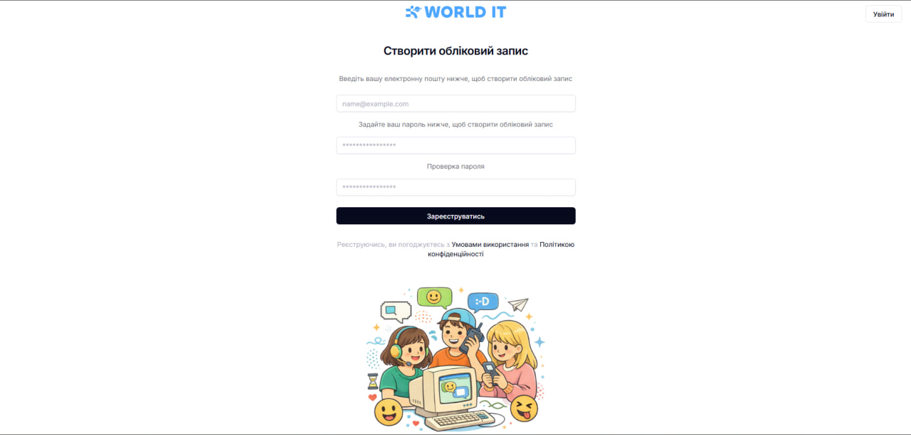
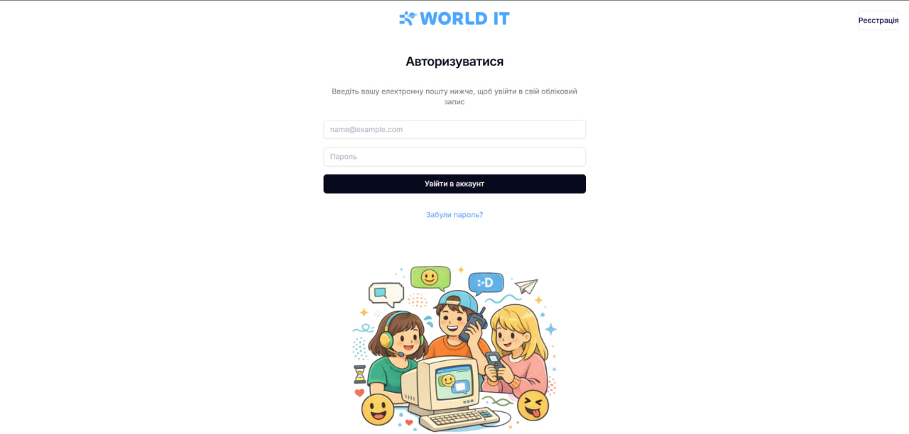
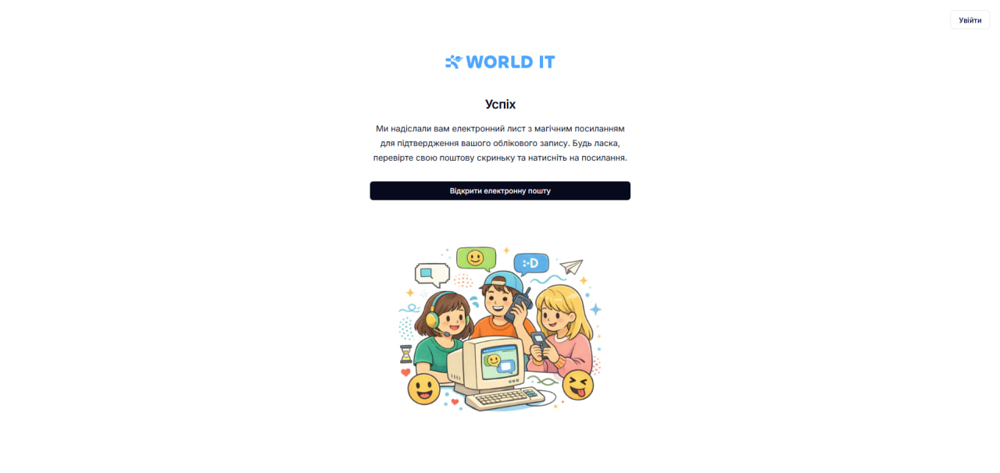
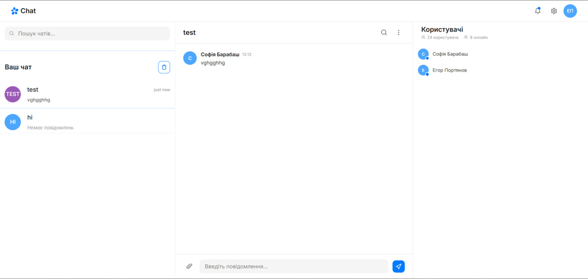

------------------------------
## iMessenger — Python Flask Web Chat Project
------------------------------
## 🇺🇦 Українська версія (Ukrainian Version)## 1. Мета створення проєкту
Проєкт iMessenger створений як випускна практична робота з програмування [INDEX]. Його головна мета — розробка сучасного веб-месенджера для обміну повідомленнями в реальному часі [INDEX].
Чим проєкт корисний для початківця:

* Розуміння клієнт-серверної архітектури: Наочно показує, як взаємодіють фронтенд (HTML/CSS/JS) та бекенд (Flask/Python) [INDEX].
* Робота з базами даних: Дає базові навички проектування таблиць, зв'язків «один-до-багатьох» та роботи з ORM (SQLAlchemy) [INDEX].
* Освоєння асинхронності (WebSockets): Допомагає зрозуміти різницю між стандартними HTTP-запитами та постійним двостороннім з'єднанням для миттєвої доставки повідомлень [INDEX].
* Модульна структура: Вчить розбивати великий код на незалежні частини (Blueprints), що є обов'язковим стандартом у реальній розробці [INDEX].

------------------------------
## 2. Склад команди
Проєкт розроблений командою з двох розробників [INDEX]:

* Єгор (Team Lead) — https://github.com/EgorPortyanov [INDEX]
* Софія (Teammate) — https://github.com/Sofia-Barabash13 [INDEX]

------------------------------
## 3. Зміст файлу (Навігація)

   1. Мета створення проєкту
   2. Склад команди
   3. Зміст файлу
   4. Перелік модулів та технологій
   5. Як запустити проєкт в роботу
   6. Зміст проєкту та роль додатків
   7. Висновок по роботі

------------------------------
## 4. Перелік модулів та технологій
При створенні чату використовувався сучасний стек технологій [INDEX]:

* Бекенд: Python 3.x, Flask (веб-фреймворк) [INDEX].
* Робота з даними: Flask-SQLAlchemy (ORM), Flask-Migrate (для міграцій), SQLite (база даних) [INDEX].
* Авторизація та безпека: Flask-Login (керування сесіями), Werkzeug (хэшування паролів), ItsDangerous (генерація токенів верифікації) [INDEX].
* Реальний час (Real-time): Flask-SocketIO (сервер), Socket.io v4 (клієнт) [INDEX].
* Фронтенд: Чистий JavaScript (ES6+), HTML5, CSS3 (адаптивна Flexbox-верстка під мобільні пристрої) [INDEX].
* Сповіщення: SMTP (модулі smtplib, email) для надсилання листів підтвердження реєстрації на пошту Gmail [INDEX].

------------------------------
## 5. Як запустити проєкт в роботу

   1. Клонуйте репозиторій або відкрийте папку проекту в VS Code:
   
   git clone https://github.com
   cd iMessenger
   
   2. Створіть та активуйте віртуальне оточення (venv):
   
   python -m venv venv# Для Windows:
   venv\Scripts\activate# Для macOS/Linux:
   source venv/bin/activate
   
   3. Встановіть необхідні бібліотеки:
   
   pip install flask flask_sqlalchemy flask_migrate flask_login flask_socketio python-dotenv
   
   4. Ініціалізуйте базу даних та виконайте міграції:
   
   flask db init
   flask db migrate
   flask db upgrade
   
   5. Запустіть головний файл проекту:
   
   python manage.py
   
   6. Відкрийте чат у браузері: Перейдіть за адресою http://127.0.0.1:5001 [INDEX].

------------------------------
## 6. Зміст проєкту та роль додатків
Проєкт побудований за модульним принципом Blueprint і розділений на дві основні логічні частини [INDEX]:
## Додаток user_app (Авторизація та керування профілем)
Відповідає за безпеку та роботу з користувачами [INDEX]. Включає в себе форми реєстрації, перевірку збігу паролів, хэшування паролів для безпечного зберігання, систему авторизації Flask-Login та генерацію унікального токена верифікації, який надсилається на пошту через Gmail SMTP [INDEX]. Також обробляє API для редагування особистих даних у налаштуваннях (ім'я, стать, дата народження) [INDEX].
Сторінка реєстрації нового облікового запису:

Сторінка авторизації / входу користувача:

Сторінка успішного завершення реєстрації та перевірки пошти:

## Додаток chat_app (Логіка чатів та WebSockets)
Відповідає за створення кімнат та комунікацію [INDEX]. Керує базою даних чатів, повідомлень та їх учасників [INDEX]. За допомогою WebSockets (SocketIO) реалізує:

* Миттєву доставку повідомлень без перезавантаження сторінки [INDEX].
* Відстеження онлайн-статусу користувачів (Online/Offline) [INDEX].
* Динамічний підрахунок непрочитаних повідомлень для кожного чату у реальному часі за допомогою лічильників-плашок [INDEX].
* Вбудовану в бокову панель картку перегляду чужого профілю з автоматичним розрахунком віку за макетом Figma [INDEX].

Головний екран інтерфейсу чату:

------------------------------
## 7. Висновок по роботі
Чим був корисний проєкт та чому ми навчились:
В ході розробки ми навчилися працювати в команді та поєднувати фронтенд з бекендом [INDEX]. Ми повністю освоїли життєвий цикл веб-додатків: від проектування бази даних та захисту паролів користувачів до побудови складних асинхронних зв'язків через веб-сокети [INDEX]. Було успішно реалізовано вимоги Figma-макету: вбудовані картки профілів, адаптивні панелі для телефонів та система лічильников повідомлень [INDEX].
Як далі можна розвивати проєкт:

   1. Додати підтримку надсилання файлів та зображень всередині повідомлень [INDEX].
   2. Реалізувати голосові та відеодзвінки на базі технології WebRTC [INDEX].
   3. Додати функцію створення групових чатів з можливістю призначення кількох адміністраторів [INDEX].
   4. Додати наскрізне шифрування (End-to-End Encryption) для повної конфіденційності листування [INDEX].

------------------------------
## 🇬🇧 English Version## 1. Project Goal
The iMessenger project was developed as a final graduation practical work in programming [INDEX]. Its primary goal is to create a modern web messenger for real-time communication [INDEX].
Why the project is useful for beginners:

* Understanding Client-Server Architecture: Visually demonstrates how the frontend (HTML/CSS/JS) interacts with the backend (Flask/Python) [INDEX].
* Database Management: Provides core skills in designing tables, configuring "one-to-many" relationships, and working with ORM (SQLAlchemy) [INDEX].
* Mastering Real-time Communication (WebSockets): Helps understand the difference between standard HTTP requests and persistent two-way connections for instant message delivery [INDEX].
* Modular Project Structure: Teaches how to break large code into independent components (Blueprints), which is a mandatory standard in commercial development [INDEX].

------------------------------
## 2. Team Members
The project was developed by a team of two developers [INDEX]:

* Egor (Team Lead) — https://github.com/EgorPortyanov [INDEX]
* Sofia (Teammate) — https://github.com/Sofia-Barabash13 [INDEX]

------------------------------
## 3. Table of Contents (Navigation)

   1. Project Goal
   2. Team Members
   3. Table of Contents
   4. Modules and Technologies
   5. How to Run the Project
   6. Project Overview and App Roles
   7. Conclusion

------------------------------
## 4. Modules and Technologies
A modern stack of web technologies was used to build this application [INDEX]:

* Backend: Python 3.x, Flask (Web Framework) [INDEX].
* Data Management: Flask-SQLAlchemy (ORM), Flask-Migrate (database migrations), SQLite (Database) [INDEX].
* Authentication & Security: Flask-Login (session management), Werkzeug (password hashing), ItsDangerous (verification token generation) [INDEX].
* Real-time Engine: Flask-SocketIO (server), Socket.io v4 (client) [INDEX].
* Frontend: Pure JavaScript (ES6+), HTML5, CSS3 (Adaptive Flexbox layouts responsive for mobile screens) [INDEX].
* Notifications: SMTP (smtplib, email modules) used for sending registration confirmation letters via Gmail [INDEX].

------------------------------
## 5. How to Run the Project

   1. Clone the repository or open the project folder in VS Code:
   
   git clone https://github.com
   cd iMessenger
   
   2. Create and activate a virtual environment (venv):
   
   python -m venv venv# For Windows:
   venv\Scripts\activate# For macOS/Linux:
   source venv/bin/activate
   
   3. Install the required libraries:
   
   pip install flask flask_sqlalchemy flask_migrate flask_login flask_socketio python-dotenv
   
   4. Initialize the database and run migrations:
   
   flask db init
   flask db migrate
   flask db upgrade
   
   5. Run the main application file:
   
   python manage.py
   
   6. Open the chat in your browser: Navigate to http://127.0.0.1:5001 [INDEX].

------------------------------
## 6. Project Overview and App Roles
The project follows a modular blueprint-driven pattern and is separated into two main logical parts [INDEX]:
## user_app Module (Authentication & Profile Management)
Handles user security [INDEX]. It includes registration forms, password matching validation, hashing for secure storage, the Flask-Login system, and unique verification token generation sent via Gmail SMTP [INDEX]. It also manages internal APIs to update personal profile settings (name, gender, birth date) [INDEX].
Account Registration Screen:

Sign In Screen:

Success Registration & Email Verification Screen:

## chat_app Module (Chat Logic & WebSockets)
Handles chat room operations and instant communication [INDEX]. It operates database records for chats, messages, and room memberships [INDEX]. Powered by WebSockets (SocketIO), it enables:

* Instant message delivery without page reloads [INDEX].
* Real-time Online/Offline user status tracking [INDEX].
* Dynamic unread message calculation displayed on sidebar badges [INDEX].
* An embedded sidebar user profile card with automatic age calculations matching the Figma mockups [INDEX].

Main Chat Screen:

------------------------------
## 7. Conclusion
What we learned and how the project was useful:
Throughout the development, we learned how to work effectively as a team and bridge frontend designs with backend routing [INDEX]. We mastered the web application life cycle: from database relations and password encryption to asynchronous websocket connections [INDEX]. All Figma design details—such as embedded profile cards, mobile-responsive drawers, and real-time message badges—were successfully implemented [INDEX].
Future Project Expansion Roadmap:

   1. Implement attachments and file/image sharing inside message rooms [INDEX].
   2. Deploy peer-to-peer audio and video calls utilizing WebRTC technology [INDEX].
   3. Introduce group channels with custom administrator permissions [INDEX].
   4. Enable End-to-End Encryption (E2EE) for ultimate user privacy [INDEX].

------------------------------
